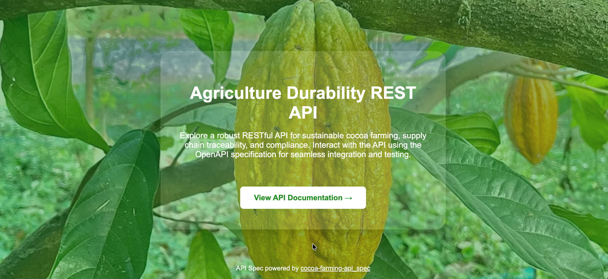

<p align="center">
    
</p>

# Agriculture Durability REST API

A comprehensive RESTful API designed to manage agricultural sustainability, supply chain traceability, and compliance with Rainforest Alliance standards. This system enables organizations to track farmers, manage inspections, oversee training programs, and ensure durability standards across agricultural value chains (Cocoa, Coffee, Banana, etc.).

[](https://github.com/prettier/prettier)

## Key Features

- **Multi-Tenant Architecture**: Robust company management with tiered subscription plans (Bronze, Silver, Gold) and billing cycles.
- **Role-Based Access Control (RBAC)**: Granular permissions for PDGs, Employees, Agents, Auditors, and Sales staff.
- **Project & Campaign Management**: Lifecycle management for inspections, mapping, and self-evaluation projects linked to seasonal campaigns.
- **Farmer & Farm Tracking**:
  - Detailed farmer profiles and certification status.
  - Farm geolocation and mapping data.
  - Inspection history and yield estimation.
- **Supply Chain Traceability**:
  - Market management and daily pricing.
  - Transaction recording, receipts, and product flow tracking from farm to warehouse.
- **Capacity Building**: Management of training sessions, attendance sheets, and competency assessments.
- **Sustainability Compliance**: Dedicated modules for auditing Agriculture, Social, Environmental, and Income/Responsibility metrics.


## Tech Stack

- **Framework:** [NestJS](https://nestjs.com/) (Node.js, Express)
- **Language:** TypeScript
- **Database:** PostgreSQL
- **ORM:** Prisma
- **API Documentation:** Swagger / OpenAPI
- **Authentication:** JWT (JSON Web Token)
- **Testing:** Jest, Supertest
- **Validation:** class-validator, class-transformer
- **Caching:** cache-manager, @nestjs/cache-manager
- **Scheduling:** @nestjs/schedule
- **Event Handling:** @nestjs/event-emitter
- **Rate Limiting:** @nestjs/throttler
- **Mailing:** nodemailer, @nestjs-modules/mailer
- **Configuration:** @nestjs/config, dotenv
- **Utilities:** lodash, moment-timezone, date-fns, rxjs
- **Code Quality:** ESLint, Prettier
- **Deployment:** Vercel (vercel.json), Docker-ready

## Prerequisites

- [Node.js](https://nodejs.org/) (v20+)
- [PostgreSQL](https://www.postgresql.org/)
- [npm](https://www.npmjs.com/)

## Installation & Setup

1.  **Clone the repository**
    ```bash
    git clone <repository-url>
    cd agriculture-durability-REST-api
    ```

2.  **Install dependencies**
    ```bash
    npm install
    ```

3.  **Environment Configuration**
    Copy the example environment file and configure your variables:
    ```bash
    cp .env.example .env
    ```
    Update the `.env` file with your database credentials and security secrets.

4.  **Database Setup**
    Run Prisma migrations to initialize the database schema:
    ```bash
    npx prisma migrate dev --name init
    ```

5.  **Generate Prisma Client**
    ```bash
    npx prisma generate
    ```

## Running the Application

Start the development server:

```bash
npm run dev
```

## Data Model

The application utilizes **Prisma** for type-safe database interactions. Key entities include:
- **Core**: `User`, `Company`, `Subscription`

## Project Structure

The project is organized as follows:

```
agriculture-durability-REST-api/
├── nest-cli.json
├── package.json
├── tsconfig.build.json
├── tsconfig.json
├── vercel.json
├── prisma/
│   ├── schema.prisma
│   └── migrations/
├── src/
│   ├── app.controller.ts
│   ├── app.module.ts
│   ├── app.service.ts
│   ├── main.ts
│   ├── adapters/
│   ├── global/
│   ├── resources/
│   └── ...
├── test/
│   ├── app.e2e-spec.ts
│   ├── auth-subscription.e2e-spec.ts
│   └── jest-e2e.json
```

### Key Directories
- **src/**: Main application source code, organized by domain and feature modules.
- **prisma/**: Database schema and migration files.
- **test/**: End-to-end and integration tests.
- **Operations**: `Project`, `Campaign`, `Training`
## Testing Strategies

The project uses **Jest** for testing, with a focus on:
- **Unit Tests**: Validate individual services and controllers.
- **Integration Tests**: Test interactions between modules and database (using Prisma).
- **End-to-End (E2E) Tests**: Simulate real API requests and responses, ensuring the application works as expected.

### Test Organization
- **test/app.e2e-spec.ts**: General E2E tests for core application flows.
- **test/auth-subscription.e2e-spec.ts**: E2E tests for authentication and subscription features.
- **src/resources/**: Feature-specific tests (unit/integration) may be located alongside implementation files.

### How to Run Tests

To run all tests:

```bash
npm run test
```

To run end-to-end tests:

```bash
npm run test:e2e
```

To run tests with coverage report:

```bash
npm run test:cov
```

Tests are configured in `jest-e2e.json` and use an isolated test database for E2E scenarios.
- **Traceability**: `Farmer`, `Farm`, `Market`, `Transaction`, `Receipt`
- **Auditing**: `Agriculture`, `Social`, `Environment`

## License

This project is licensed under the MIT License.
